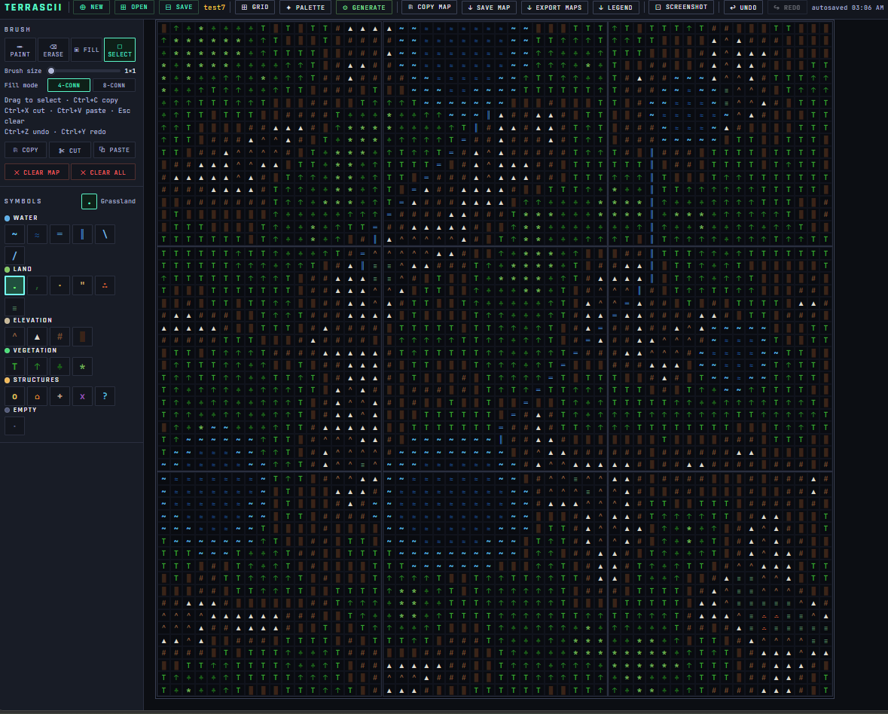

# TERRASCII

> A self-contained ASCII tilemap editor for game designers, writers, and worldbuilders.



No build tools. No dependencies. No server. Download one HTML file, open it in a browser, and start mapping.

---

## What Is It?

TERRASCII is a browser-based ASCII tilemap editor built entirely in vanilla HTML, CSS, and JavaScript. It's designed for tabletop RPG designers, indie game developers, writers crafting fictional worlds, and anyone who needs to create expressive maps using characters and symbols.

The entire application ships as a **single `.html` file**. You can host it on a web server, share it by email, or just keep it on your desktop — it works the same way in all cases.

---

## Features

### Canvas & Editing

- **Configurable grid** — set the number of tiles (cols × rows), tile dimensions in cells, and pixel size per cell
- **Four brush modes** — Paint, Erase, Flood Fill, and Select
- **Variable brush sizes** — 1×1, 3×3, 5×5, and 7×7 cell brushes
- **4-connected and 8-connected flood fill** — toggle diagonal fill behavior in the sidebar
- **Rectangular selection** with Copy, Cut, and Paste (four placement modes: top-left, cursor, same position as source, or custom map + offset)
- **Per-cell color overrides** — individual cells can have colors independent of their palette defaults
- **Undo / Redo** (Ctrl+Z / Ctrl+Y) — full snapshots before every major operation, 50-step stack
- **Coordinate status bar** — shows tile, cell, and world coordinates on hover

### Symbol Palette

- **Fully editable palette** — add, remove, and reorder categories and symbols
- **Per-symbol color overrides** alongside category-level defaults
- **Color clipboard** — copy a hex color from one symbol and paste it to another
- **Active symbol indicator** always visible in the sidebar

### Terrain Generation

Open the **Generate** modal to fill tiles procedurally. Three tabs, each with its own approach:

**Weighted Random**
Assign percentage weights to any symbols. A live CDF bar shows the distribution as you type. Coherence slider adds smoothing passes after generation. Choose to overwrite all cells or skip non-empty ones.

**Perlin Noise**
Each symbol gets a dual-handle noise band defining the value range it occupies. Per-symbol enable/disable checkboxes let you leave gaps intentionally. Controls for scale, octaves, seed, and coherence. Includes **Random Bands** (randomised non-overlapping ranges) and **Reset** (even distribution).

**Water**
Two ordered passes designed to be run after terrain generation:

1. **Bodies of Water** — Poisson-disk sampled lakes with user-defined depth rings (center → shore). Each ring specifies a symbol and relative width. Lake shapes are organically varied using Perlin-wobbled ellipses.
2. **Rivers & Streams** — Explicit source → destination pairs. Each path is drawn with noise-guided meander and a destination-pull force. Rivers use `═`/`║` for cardinal movement; streams use `\`/`/` for diagonal. Source and destination points are set by clicking directly on the map while the modal fades transparent.

The Water category is automatically excluded from Weighted and Perlin generation.

### Generation Presets

- Save named presets capturing all three tabs — weights, bands, rings, river pairs, everything
- Presets travel with the project `.json` file
- Export presets as a standalone `.json`; import and merge from file

### Export & Project Management

| Action | Result |
|---|---|
| **Save Project** | Downloads a `.json` file with the full project state |
| **Open Project** | Loads a previously saved `.json` |
| **New Project** | Resets to a fresh grid with a new name |
| **Save Map** | Downloads the active tile as a `.txt` file |
| **Export Maps** | Downloads every tile as individual `.txt` files |
| **Copy Map** | Copies the active tile text to the system clipboard |
| **Legend** | Exports the symbol palette as a reference `.json` |

**Autosave** runs automatically in the background (debounced, 900 ms after any change) using `localStorage`. Your work is restored the next time you open the file in the same browser.

### Screenshot Mode

Hides the header, sidebar, grid lines, tile borders, and active-map highlight. The map fills the view with 20 px of clean padding — ready for your OS or browser screenshot tool. Press **Escape** or click the exit button to return to the editor.

---

## Getting Started

1. Download `TERRASCII.html`
2. Open it in any modern browser (Chrome, Firefox, Safari, Edge)
3. Start painting

That's it. There's nothing to install.

---

## Keyboard Shortcuts

| Shortcut | Action |
|---|---|
| `Ctrl + Z` | Undo |
| `Ctrl + Y` | Redo |
| `Ctrl + C` | Copy selection |
| `Ctrl + X` | Cut selection |
| `Ctrl + V` | Open Paste modal |
| `Ctrl + S` | Save project |
| `Escape` | Clear selection / Exit screenshot mode |

---

## Project File Format

Projects are saved as JSON (schema version 1):

```json
{
  "version": 1,
  "name": "my-world",
  "gridCols": 3,
  "gridRows": 3,
  "tileW": 18,
  "tileH": 18,
  "cellPx": 22,
  "categories": [ ... ],
  "maps": [ ... ],
  "cellColors": { ... },
  "genPresets": [ ... ]
}
```

Maps are stored as arrays of strings (one string per row). Cell color overrides are keyed as `"mi,row,col"`. Generation presets include the full state of all three generator tabs.

---

## Default Symbol Palette

TERRASCII ships with six categories out of the box:

| Category | Symbols |
|---|---|
| **Water** | `~` shallow · `≈` deep · `═` `║` river · `\` `/` stream |
| **Land** | `.` grass · `,` scrub · `·` plains · `"` desert · `∴` badlands · `≡` swamp |
| **Elevation** | `^` hills · `▲` peak · `#` cliffs · `█` impassable |
| **Vegetation** | `T` tree · `↑` pine · `♣` forest · `*` brush |
| **Structures** | `o` settlement · `⌂` town · `+` temple · `x` dungeon · `?` POI |
| **Empty** | ` ` clear |

All categories and symbols are fully editable.

---

## Architecture

TERRASCII is intentionally dependency-free and build-free. The entire codebase is one file:

- **Pure HTML + CSS + vanilla JS** — no frameworks, no modules, no transpilation
- **All state is module-level variables** — no classes, no global state objects
- **Undo/redo** via JSON snapshots of `{maps, cellColors}` on a capped array stack
- **Seeded LCG + Perlin noise** — `makePerlin()` / `octaveNoise()` — fully self-contained
- **Flood fill** — iterative stack-based, no recursion, 4- or 8-connected
- **Poisson-disk sampling** for even lake distribution
- **Noise-guided river pathfinding** with destination-pull blending and 4-step backtrack memory to prevent self-crossing
- **World-coordinate accessors** (`worldGet` / `worldSet`) enable seamless generation across tile boundaries
- **CSS custom properties** (`--bg`, `--text`, `--accent`, …) make theming straightforward
- Screenshot mode is a single CSS class toggle on `<body>`

---

## Browser Compatibility

Any modern browser with ES2020 support. No polyfills required.

- Chrome 88+
- Firefox 85+
- Safari 14+
- Edge 88+

Running from a local `file://` path disables `localStorage` autosave in some browsers. Serving the file over `http://localhost` (e.g. with `npx serve .`) restores autosave if needed.

---

## License

MIT — see [LICENSE](LICENSE) for details.

---

### AI Assistance Notice
TERRASCII was designed, directed, and authored by Pablo (Furious Quan). Coding was 100% done by Claude Sonnet 4.6. All architecture, features, algorithms, and design decisions were reviewed by the author. The final code has been tested and is considered a work in progress.

---

## Contributing

Issues and pull requests are welcome. Because the project is a single self-contained file, the contribution bar is low — no build environment to set up, no dependencies to install. Open the file, make your changes, verify in a browser, and submit a PR.

When contributing new features, please keep the zero-dependency, single-file constraint intact.

---

## Contact

[furioquan@gmail.com](mailto:furioquan@gmail.com)
[X](https://x.com/waywardisopod)
